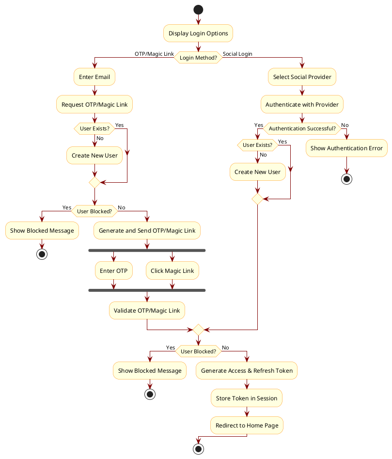

# VePhim - Activities Diagrams

1. Auth Activity

```plantuml
@startuml Login Process Activity Diagram

skinparam ActivityBackgroundColor LightYellow
skinparam ActivityBorderColor DarkOrange
skinparam ArrowColor Maroon

start

:Display Login Options;

if (Login Method?) then (OTP/Magic Link)
  :Enter Email;
  :Request OTP/Magic Link;
  
  if (User Exists?) then (No)
    :Create New User;
  else (Yes)
  endif
  
  if (User Blocked?) then (Yes)
    :Show Blocked Message;
    stop
  else (No)
    :Generate and Send OTP/Magic Link;
    
    fork
      :Enter OTP;
    fork again
      :Click Magic Link;
    end fork
    
    :Validate OTP/Magic Link;
  endif
  
else (Social Login)
  :Select Social Provider;
  :Authenticate with Provider;
  
  if (Authentication Successful?) then (Yes)
    if (User Exists?) then (No)
      :Create New User;
    else (Yes)
    endif
  else (No)
    :Show Authentication Error;
    stop
  endif
endif

if (User Blocked?) then (Yes)
  :Show Blocked Message;
  stop
else (No)
  :Generate Access & Refresh Token;
  :Store Token in Session;
  :Redirect to Home Page;
endif

stop

@enduml
```
