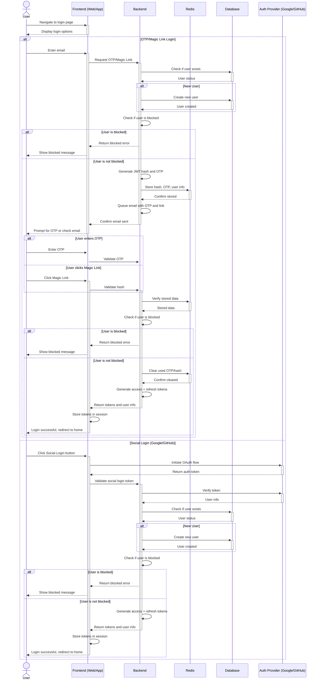

# VePhim - Sequence Diagrams

1. Auth Sequence

```mermaid
sequenceDiagram
    actor User
    participant Frontend as Frontend (Web/App)
    participant Backend
    participant Redis
    participant Database
    participant AuthProvider as Auth Provider (Google/GitHub)

    User->>+Frontend: Navigate to login page
    Frontend-->>-User: Display login options

    alt OTP/Magic Link Login
        User->>+Frontend: Enter email
        Frontend->>+Backend: Request OTP/Magic Link
        Backend->>+Database: Check if user exists
        Database-->>-Backend: User status
        alt New User
            Backend->>+Database: Create new user
            Database-->>-Backend: User created
        end
        Backend->>Backend: Check if user is blocked
        alt User is blocked
            Backend-->>Frontend: Return blocked error
            Frontend-->>User: Show blocked message
        else User is not blocked
            Backend->>Backend: Generate JWT hash and OTP
            Backend->>+Redis: Store hash, OTP, user info
            Redis-->>-Backend: Confirm stored
            Backend->>Backend: Queue email with OTP and link
            Backend-->>-Frontend: Confirm email sent
            Frontend-->>-User: Prompt for OTP or check email

            alt User enters OTP
                User->>+Frontend: Enter OTP
                Frontend->>+Backend: Validate OTP
            else User clicks Magic Link
                User->>+Frontend: Click Magic Link
                Frontend->>+Backend: Validate hash
            end
            Backend->>+Redis: Verify stored data
            Redis-->>-Backend: Stored data
            Backend->>Backend: Check if user is blocked
            alt User is blocked
                Backend-->>Frontend: Return blocked error
                Frontend-->>User: Show blocked message
            else User is not blocked
                Backend->>+Redis: Clear used OTP/hash
                Redis-->>-Backend: Confirm cleared
                Backend->>Backend: Generate access + refresh tokens
                Backend-->>-Frontend: Return tokens and user info
                Frontend->>Frontend: Store tokens in session
                Frontend-->>-User: Login successful, redirect to home
            end
        end

    else Social Login (Google/GitHub)
        User->>+Frontend: Click Social Login button
        Frontend->>+AuthProvider: Initiate OAuth flow
        AuthProvider-->>-Frontend: Return auth token
        Frontend->>+Backend: Validate social login token
        Backend->>+AuthProvider: Verify token
        AuthProvider-->>-Backend: User info
        Backend->>+Database: Check if user exists
        Database-->>-Backend: User status
         alt New User
            Backend->>+Database: Create new user
            Database-->>-Backend: User created
        end
        Backend->>Backend: Check if user is blocked
        alt User is blocked
            Backend-->>Frontend: Return blocked error
            Frontend-->>User: Show blocked message
        else User is not blocked
            Backend->>Backend: Generate access + refresh tokens
            Backend-->>-Frontend: Return tokens and user info
            Frontend->>Frontend: Store tokens in session
            Frontend-->>-User: Login successful, redirect to home
        end
    end
```
