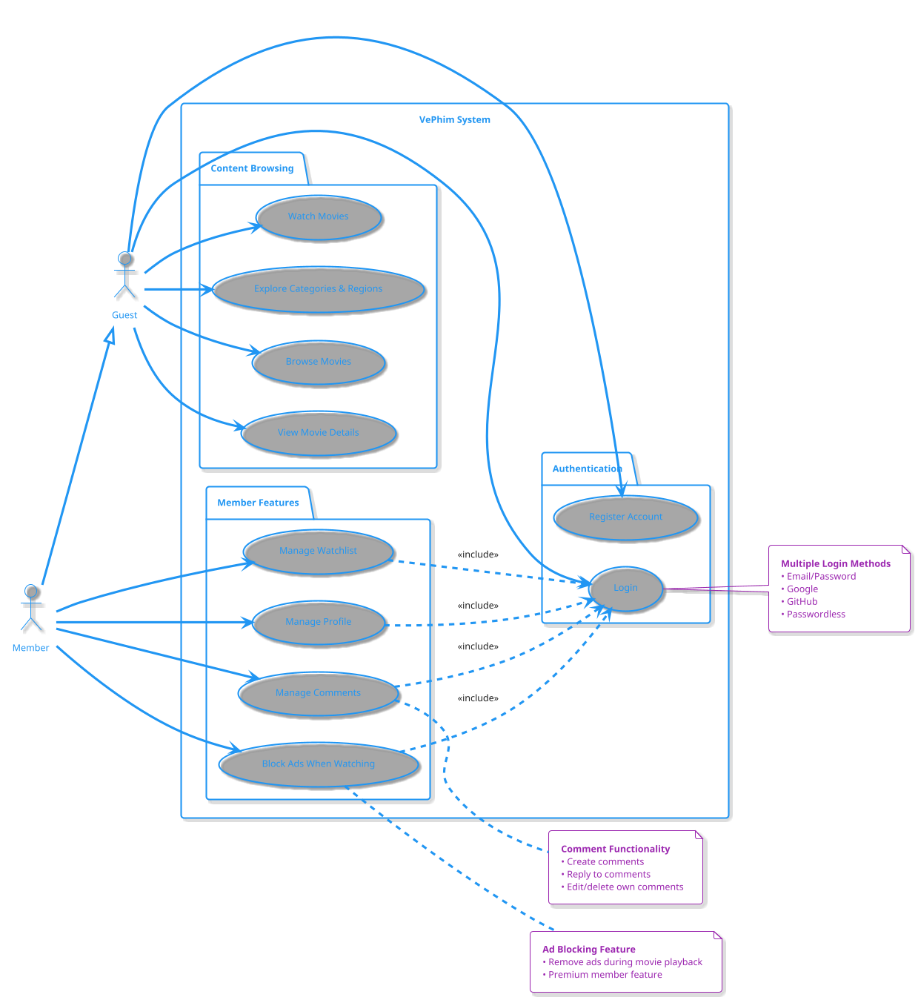
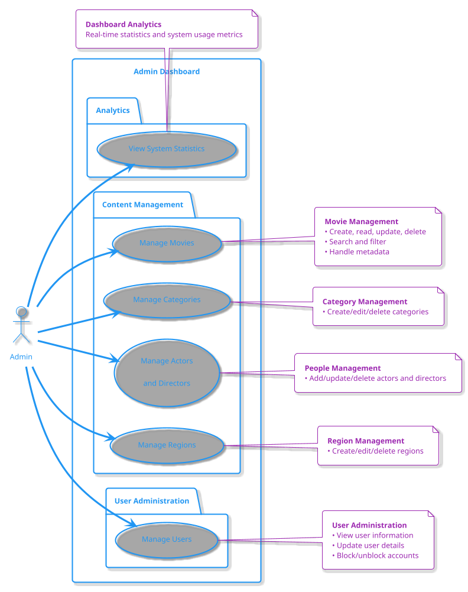

# VePhim - Use Case Diagrams

## 1. User Use Case Diagram

```plantuml
@startuml VePhim User Use Case Diagram

!theme materia-outline

left to right direction

actor Guest as g
actor Member as m

m --|> g

rectangle "VePhim System" {
  package "Content Browsing" {
    usecase "Browse Movies" as UC1
    usecase "View Movie Details" as UC2
    usecase "Watch Movies" as UC3
    usecase "Explore Categories & Regions" as UC4
  }

  package "Authentication" {
    usecase "Register Account" as UC7
    usecase "Login" as UC8
  }

  package "Member Features" {
    usecase "Manage Watchlist" as UC9
    usecase "Manage Comments" as UC10
    usecase "Manage Profile" as UC11
    usecase "Block Ads When Watching" as UC12
  }
}

' Simplified Guest relationships
g --> UC1
g --> UC2
g --> UC3
g --> UC4
g --> UC7
g --> UC8

' Member-specific features
m --> UC9
m --> UC10
m --> UC11
m --> UC12

' Only the most critical relationships
UC9 ..> UC8 : <<include>>
UC10 ..> UC8 : <<include>>
UC11 ..> UC8 : <<include>>
UC12 ..> UC8 : <<include>>

note right of UC8
  <b>Multiple Login Methods</b>
  • Email/Password
  • Google
  • GitHub
  • Passwordless
end note

note right of UC10
  <b>Comment Functionality</b>
  • Create comments
  • Reply to comments
  • Edit/delete own comments
end note

note right of UC12
  <b>Ad Blocking Feature</b>
  • Remove ads during movie playback
  • Premium member feature
end note

@enduml
```

## 2. Admin Use Case Diagram

```plantuml
@startuml VePhim Admin Use Case Diagram

!theme materia-outline

left to right direction

actor "Admin" as admin

rectangle "Admin Dashboard" {
  package "Analytics" {
    usecase "View System Statistics" as UC1
  }

  package "Content Management" {
    usecase "Manage Movies" as UC2
    usecase "Manage Categories" as UC3
    usecase "Manage Actors\nand Directors" as UC4
    usecase "Manage Regions" as UC5
  }

  package "User Administration" {
    usecase "Manage Users" as UC6
  }
}

' Simplified admin relationships
admin --> UC1
admin --> UC2
admin --> UC3
admin --> UC4
admin --> UC5
admin --> UC6

note bottom of UC1
  <b>Dashboard Analytics</b>
  Real-time statistics and system usage metrics
end note

note right of UC2
  <b>Movie Management</b>
  • Create, read, update, delete
  • Search and filter
  • Handle metadata
end note

note right of UC3
  <b>Category Management</b>
  • Create/edit/delete categories
end note

note right of UC4
  <b>People Management</b>
  • Add/update/delete actors and directors
end note

note right of UC5
  <b>Region Management</b>
  • Create/edit/delete regions
end note

note right of UC6
  <b>User Administration</b>
  • View user information
  • Update user details
  • Block/unblock accounts
end note

@enduml
```
