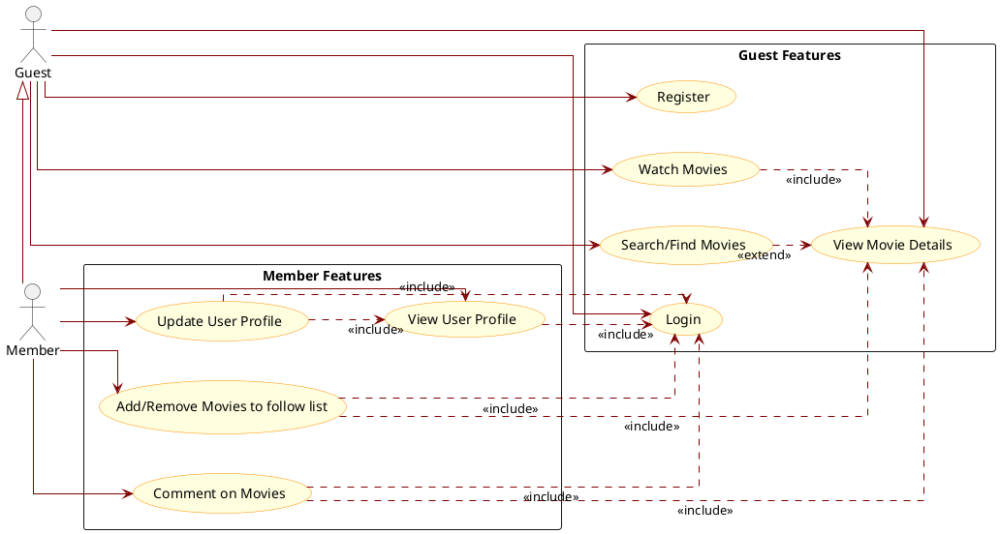
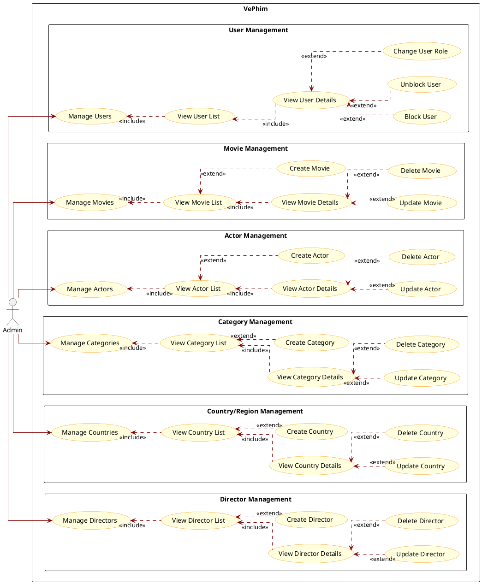

# VePhim - Use Case Diagrams

1. Guest/Member Use Case

```plantuml
@startuml VePhim Guest/Member Use Case Diagram

skinparam usecase {
  BackgroundColor LightYellow
  BorderColor DarkOrange
  ArrowColor Maroon
  ActorBorderColor OrangeRed
}

skinparam packageStyle rectangle
skinparam linetype ortho

skinparam nodesep 40
skinparam ranksep 40

left to right direction

actor Guest
actor Member

Guest <|- Member

' rectangle "VePhim" {
  package "Guest Features" {
    usecase "Search/Find Movies" as UC1
    usecase "Watch Movies" as UC2
    usecase "View Movie Details" as UC3
    usecase "Login" as UC4
    usecase "Register" as UC5
  }
  
  package "Member Features" {
    usecase "Add/Remove Movies to follow list" as UC6
    usecase "Comment on Movies" as UC7
    usecase "View User Profile" as UC8
    usecase "Update User Profile" as UC9
  }
' }

Guest --> UC1
Guest --> UC2
Guest --> UC3
Guest --> UC4
Guest --> UC5

Member --> UC6
Member --> UC7
Member --> UC8
Member --> UC9

UC2 ..> UC3 : <<include>>
UC1 ..> UC3 : <<extend>>
UC6 ..> UC3 : <<include>>
UC7 ..> UC3 : <<include>>
UC9 ..> UC8 : <<include>>

UC6 ..> UC4 : <<include>>
UC7 ..> UC4 : <<include>>
UC8 ..> UC4 : <<include>>
UC9 ..> UC4 : <<include>>
@enduml
```

---

2. Admin Use Cases

```plantuml
@startuml VePhim Admin Use Case Diagram

skinparam usecase {
  BackgroundColor LightYellow
  BorderColor DarkOrange
  ArrowColor Maroon
  ActorBorderColor OrangeRed
}

skinparam packageStyle rectangle
skinparam linetype ortho

left to right direction

actor "Admin" as admin

rectangle "VePhim" {
  package "User Management" {
    usecase "Manage Users" as UC1
    usecase "View User List" as UC1_1
    usecase "View User Details" as UC1_2
    usecase "Block User" as UC1_3
    usecase "Unblock User" as UC1_4
    usecase "Change User Role" as UC1_5
  }

  package "Movie Management" {
    usecase "Manage Movies" as UC2
    usecase "View Movie List" as UC2_1
    usecase "View Movie Details" as UC2_2
    usecase "Create Movie" as UC2_3
    usecase "Update Movie" as UC2_4
    usecase "Delete Movie" as UC2_5
  }

  package "Actor Management" {
    usecase "Manage Actors" as UC3
    usecase "View Actor List" as UC3_1
    usecase "View Actor Details" as UC3_2
    usecase "Create Actor" as UC3_3
    usecase "Update Actor" as UC3_4
    usecase "Delete Actor" as UC3_5
  }

  package "Category Management" {
    usecase "Manage Categories" as UC4
    usecase "View Category List" as UC4_1
    usecase "View Category Details" as UC4_2
    usecase "Create Category" as UC4_3
    usecase "Update Category" as UC4_4
    usecase "Delete Category" as UC4_5
  }

  package "Country/Region Management" {
    usecase "Manage Countries" as UC5
    usecase "View Country List" as UC5_1
    usecase "View Country Details" as UC5_2
    usecase "Create Country" as UC5_3
    usecase "Update Country" as UC5_4
    usecase "Delete Country" as UC5_5
  }

  package "Director Management" {
    usecase "Manage Directors" as UC6
    usecase "View Director List" as UC6_1
    usecase "View Director Details" as UC6_2
    usecase "Create Director" as UC6_3
    usecase "Update Director" as UC6_4
    usecase "Delete Director" as UC6_5
  }
}

' Admin relationships
admin --> UC1
admin --> UC2
admin --> UC3
admin --> UC4
admin --> UC5
admin --> UC6

' Manage Users include relationships
UC1 <.. UC1_1 : <<include>>
UC1_1 <.. UC1_2 : <<include>>
UC1_2 <.. UC1_3 : <<extend>>
UC1_2 <.. UC1_4 : <<extend>>
UC1_2 <.. UC1_5 : <<extend>>

' Manage Movies include relationships
UC2 <.. UC2_1 : <<include>>
UC2_1 <.. UC2_2 : <<include>>
UC2_1 <.. UC2_3 : <<extend>>
UC2_2 <.. UC2_4 : <<extend>>
UC2_2 <.. UC2_5 : <<extend>>

' Manage Actors include relationships
UC3 <.. UC3_1 : <<include>>
UC3_1 <.. UC3_2 : <<include>>
UC3_1 <.. UC3_3 : <<extend>>
UC3_2 <.. UC3_4 : <<extend>>
UC3_2 <.. UC3_5 : <<extend>>

' Manage Categories include relationships
UC4 <.. UC4_1 : <<include>>
UC4_1 <.. UC4_2 : <<include>>
UC4_1 <.. UC4_3 : <<extend>>
UC4_2 <.. UC4_4 : <<extend>>
UC4_2 <.. UC4_5 : <<extend>>

' Manage Countries include relationships
UC5 <.. UC5_1 : <<include>>
UC5_1 <.. UC5_2 : <<include>>
UC5_1 <.. UC5_3 : <<extend>>
UC5_2 <.. UC5_4 : <<extend>>
UC5_2 <.. UC5_5 : <<extend>>

' Manage Directors include relationships
UC6 <.. UC6_1 : <<include>>
UC6_1 <.. UC6_2 : <<include>>
UC6_1 <.. UC6_3 : <<extend>>
UC6_2 <.. UC6_4 : <<extend>>
UC6_2 <.. UC6_5 : <<extend>>

@enduml
```
